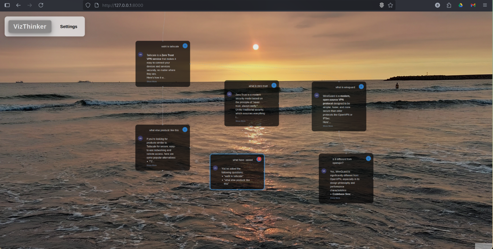

<p align="center">
  
</p>

# VizThinker AI

A desktop app for visual thinkers, powered by LLMs, that swaps the linear chat format for a dynamic, node-based graph. Explore ideas the way your brain does—branching, connecting, and visualizing concepts in an interactive canvas.

## Are You a VizThinker?

A VizThinker is someone whose brain loves to map ideas like a web, not a straight line. You’re the type who doodles mind maps, sees connections everywhere, and gets frustrated scrolling through endless chat threads to find that *one* key point. VizThinker AI is built for you—turning your chats with an AI into a visual graph where ideas flow, branch, and connect, just like your thoughts do.

## What's the Big Idea?

# VizThinker AI

**VizThinker is a node-based AI chat interface that transforms your conversations into dynamic, interactive thinking maps. Move beyond linear chats and visualize the flow of your ideas.**

Traditional chatbots are restrictive, forcing conversations into a single, linear thread. VizThinker breaks that mold by allowing you to branch off at any point, explore tangents, and build a visual network of your thoughts. Each interaction with the LLM creates a new node on an infinite canvas, letting you see how your ideas connect and evolve.

<p align="center">
  
</p>

## Key Features

- **🧠 Node-Based Conversations**: Every prompt and response becomes a node in a graph. Create direct follow-ups or branch out to explore new ideas without losing context.
- **🔗 Visual Branching**: Differentiate between deep dives (vertical, solid lines) and exploratory tangents (horizontal, dotted lines) for a clear, organized thought process.
- **🤖 Multi-Provider LLM Integration**: Connect to your favorite LLM providers, including **Google (Gemini)**, **OpenAI (GPT)**, **Anthropic (Claude)**, **X (Grok)**, and local instances via **Ollama**.
- **🔐 User Authentication**: Secure login and signup system to keep your conversation maps private and persistent.
- **💾 Persistent Sessions**: Your conversations are automatically saved. Log in from anywhere and pick up right where you left off.
- **⚙️ Customizable Experience**: Use the settings panel to configure API keys, select your preferred provider and model, and customize the look and feel of your graph.
- **📤 Multiple Export Options**:
  - **HTML**: Export your conversation as a fully interactive, self-contained web page.
  - **PNG**: Save a high-quality image of your entire thinking map.
  - **Markdown**: Use the AI to generate a structured, professional summary of your conversation, perfect for documentation or sharing.
- **🖱️ Intuitive Interface**: A polished and responsive interface with an infinite canvas, smooth panning/zooming, and a clean, modern design.

<p align="center">
  
</p>

## Tech Stack

- **Frontend**: React, Vite, TypeScript, Chakra UI, ReactFlow, Zustand
- **Backend**: FastAPI (Python), Uvicorn
- **Database**: PostgreSQL
- **LLM Integration**: Direct API calls to Google, OpenAI, Anthropic, X, and Ollama.

## Installation & Running

**Prerequisites:**
- Node.js & npm
- Python & pip
- PostgreSQL

**1. Clone the repository:**
```bash
git clone https://github.com/jasoncyhsu/vizthinker.git
cd vizthinker
```

**2. Configure Environment Variables:**
Create a `.env` file in the root directory and add your PostgreSQL database connection details:
```
DB_USER=your_db_user
DB_PASSWORD=your_db_password
DB_HOST=localhost
DB_PORT=5432
DB_NAME=vizthinker
```

**3. Install Dependencies:**
A convenient `Makefile` command is provided to set up everything.
```bash
make install
```
This will create a Python virtual environment (`.venv`) and install all required `npm` and `pip` packages.

**4. Build the Application:**
This command compiles the frontend code into a static build (`dist` folder).
```bash
make build
```

**5. Run the Application:**
This command starts the backend server and launches the application.
```bash
make run
```

The application will be available at `http://127.0.0.1:8000`.

## License

This project is licensed under the MIT License. See the [LICENSE](LICENSE) file for details.

