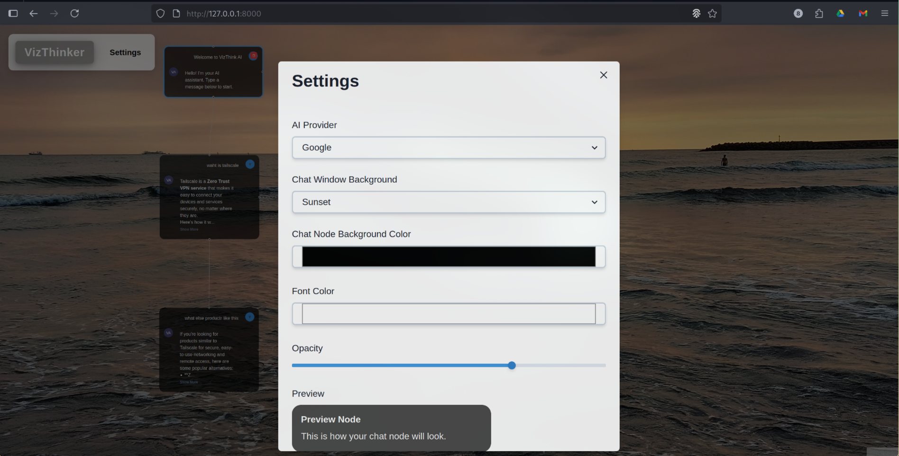

<p align="center">
  
</p>

# VizThink AI

A desktop app for visual thinkers, powered by LLMs, that swaps the linear chat format for a dynamic, node-based graph. Explore ideas the way your brain does—branching, connecting, and visualizing concepts in an interactive canvas.

## Are You a VizThinker?

A VizThinker is someone whose brain loves to map ideas like a web, not a straight line. You’re the type who doodles mind maps, sees connections everywhere, and gets frustrated scrolling through endless chat threads to find that *one* key point. VizThink AI is built for you—turning your chats with an AI into a visual graph where ideas flow, branch, and connect, just like your thoughts do.

## What's the Big Idea?

Traditional chatbots like ChatGPT are stuck in a top-down, scroll-heavy rut. That’s rough for VizThinkers who see ideas as a network of connections. VizThink AI lets you interact with an LLM through a node-based interface where every prompt, response, or follow-up becomes a node in a graph. Dig deeper into a topic (vertical nodes) or branch off to explore related ideas (horizontal nodes), all while seeing your thought process come to life as a visual map.

## Key Features

- **Node-Based Chats**: Start with a root prompt, then add follow-up or branching nodes to dive deep or explore tangents.
- **Dynamic Graph**: Watch your conversation grow into an interactive graph with clear vertical (deep dive) and horizontal (side quest) connections.
- **LLM Power**: Send node content to an LLM (like Google Generative AI) and get responses as new nodes.
- **Visually Distinct Branching**: Create follow-up nodes (solid lines) or branching nodes (dotted lines) to organize your thoughts.
- **Interactive Canvas**: Pan, zoom, and select nodes to navigate your idea graph.
- **Customizable Experience**: Tailor the look and feel with a settings modal for different LLM providers (Google Generative AI, Ollama), themes, and colors.
- **Desktop Native**: Runs as a standalone desktop application for a seamless, focused experience.
- **Persistent Sessions**: Automatically saves your graph to a local SQLite database and restores it on startup.


## User Stories

- As a VizThinker, I want to see my chat as a graph to track how ideas connect.
- As a VizThinker, I want to branch off a specific point in an LLM response to dig into it without losing the main thread.
- As a VizThinker, I want to save my idea graph locally and revisit it later.

## Installation & Running
Dependencies:
- Node.js
- Python
- SQLite
- Modern web browser (Chrome, Firefox, Safari, Edge)

- **1. Clone the repository**
  ```bash
  git clone https://github.com/jasoncyhsu/vizthinker.git
  cd vizthinker
  ```

- **2. Install all dependencies**
  This single command will verify your setup, create a Python virtual environment, and install all required Node.js and Python packages.
  ```bash
  make install
  ```

- **3. Build the application**
  This command compiles the frontend code into a static build.
  ```bash
  make build
  ```

- **4. Run the application**
  This command starts the backend server and launches the desktop application.
  ```bash
  make run
  ```


## Roadmap

- **Phase 1: Core Functionality (Complete)**
  - ✅ Node-based graph interface with branching logic.
  <p align="center">
    
  </p>
  <p align="center">
    
  </p>
  - ✅ Integration with multiple LLM providers (Google, Ollama).
  - ✅ Standalone desktop application 
  - ✅ Local session persistence with SQLite.
  - ✅ Customizable settings modal for themes and providers.
  <p align="center">
    
  </p>


- **Phase 2: UI/UX Polish & Advanced Features (In Progress)**
  - ⏳ Refine graph layout and node interactions.
  - ⏳ Implement node content editing and styling.
  - ⏳ Explore automatic graph layout algorithms.

- **Phase 3: Testing & Release**
  - 📋 Beta testing with fellow VizThinkers.
  - 🚀 First official release.

### Future Vibes
- Drag nodes around and try new graph layouts.
- Add images or links to nodes.
- Export graphs as PNG or JSON.
- Let multiple VizThinkers collaborate on the same graph.
- Search and navigate huge graphs easily.

## Why It Rocks

VizThink AI is built for folks who think in networks, not lists. It’s a game-changer for brainstorming, research, or just exploring big ideas on your desktop. We’re starting simple but aiming big—join us to make thinking with AI as visual as your imagination!

## Contributing

Got ideas? Found a bug? Open an issue or submit a PR! We’re all about feedback from VizThinkers to make this app shine.

## License

MIT License—feel free to fork and play around!